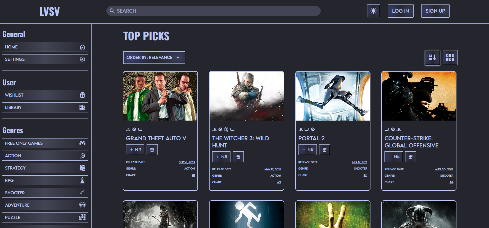
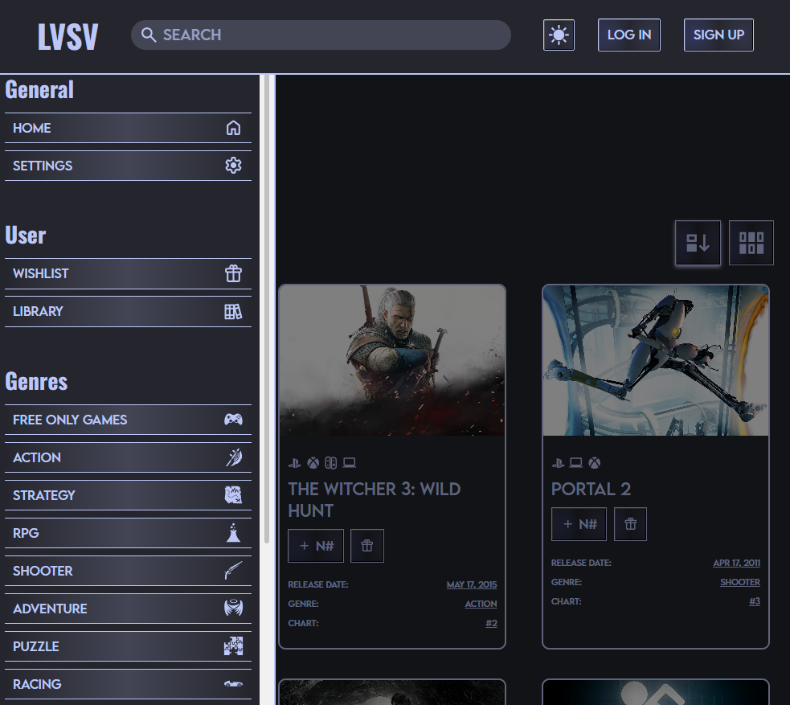
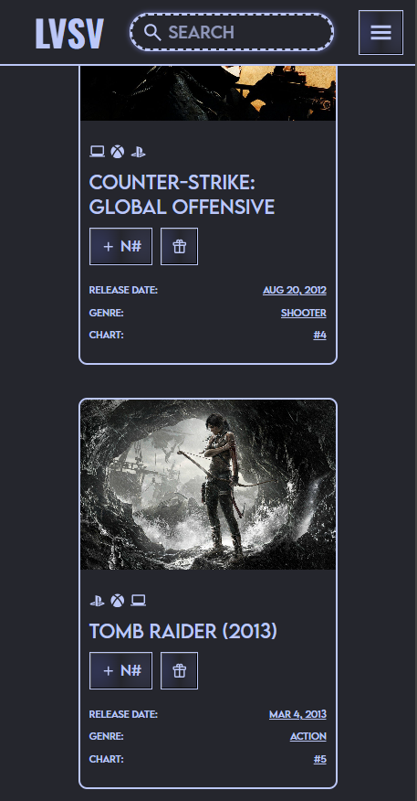

# VideogamesStore

Aplicación web de tienda de videojuegos desarrollada con Vue 3 y Vite.

## Descripción del Aplicativo

VideogamesStore es una aplicación web moderna que permite a los usuarios explorar y descubrir videojuegos. La aplicación consume datos de una API externa para mostrar información detallada sobre diferentes juegos, incluyendo categorías, plataformas y más. Cuenta con una interfaz intuitiva con navegación lateral, búsqueda de juegos y visualización de tarjetas de juegos.

### Características principales:

- Exploración de catálogo de videojuegos
- Filtrado por categorías y plataformas
- Búsqueda de juegos
- Diseño responsive y moderno
- Integración con API de videojuegos

## API Utilizada

**RAWG Video Games Database API**

- **URL:** [https://rawg.io](https://rawg.io)
- **Documentación:** [https://rawg.io/apidocs](https://rawg.io/apidocs)

RAWG es la base de datos de videojuegos más grande del mundo, con más de 500,000 juegos para más de 50 plataformas. Proporciona información detallada sobre juegos, géneros, plataformas, desarrolladores y más.

## Capturas de Pantalla

<!-- Agregar capturas de pantalla aquí -->







## Instrucciones de Ejecución

### Requisitos previos

- Node.js (versión 18 o superior)
- npm (incluido con Node.js)

### Instalación

1. Clonar el repositorio:

```sh
git clone <url-del-repositorio>
cd VideogamesStore
```

2. Instalar las dependencias:

```sh
npm install
```

### Ejecución en modo desarrollo

```sh
npm run dev
```

La aplicación estará disponible en `http://localhost:5173`

### Compilar para producción

```sh
npm run build
```

### Vista previa de producción

```sh
npm run preview
```

### Linting y formateo

```sh
npm run lint
npm run format
```

## Tecnologías Utilizadas

- **Vue 3** - Framework de JavaScript
- **Vite** - Build tool y servidor de desarrollo
- **Pinia** - Gestión de estado
- **Vue Router** - Enrutamiento
- **ESLint** - Linting de código
- **Prettier** - Formateo de código

## Estructura del Proyecto

```
VideogamesStore/
├── src/
│   ├── components/     # Componentes Vue
│   ├── Icons/          # Iconos SVG como componentes
│   ├── Images/         # Imágenes estáticas
│   ├── router/         # Configuración de rutas
│   ├── services/       # Servicios de API
│   ├── stores/         # Stores de Pinia
│   └── Styles/         # Estilos CSS
├── api/                # Configuración de API
└── public/             # Archivos públicos
```

## IDE Recomendado

[VS Code](https://code.visualstudio.com/) + [Vue (Official)](https://marketplace.visualstudio.com/items?itemName=Vue.volar)
